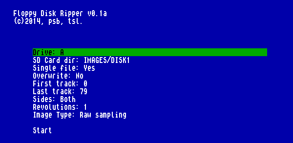

#[Floppy Disk Ripper v0.1 alpha](https://github.com/psbhlw/floppy-disk-ripper)
---

## Описание

Floppy Disk Ripper - программа для низкоуровневого чтения дискет с целью создания образов с произвольным форматом хранения физических данных на них.

Для работы требуется компьютер [ZX Evolution](http://www.nedopc.com/zxevo/zxevo.php) со специальной прошивкой, которая обеспечивает захват данных с дисковода, минуя контроллер. В качестве источника поддерживаются дисководы A-D. Собранные данные сохраняются на SD-карту, форматированную в FAT32/16/12.

Захват данных с дискеты производится аппаратным модулем, который принимает сигнал READ DATA с дисковода и замеряет время между импульсами записанных данных в периодах частоты 14 МГц. Данные сохраняются в файл для последующей обработки на PC. При захвате не происходит декодирования данных, а также проверки и коррекции ошибок.

Чтение каждого трека начинается по началу индекса дорожки и заканчивается по концу индекса после заданного количества оборотов диска. Таким образом, можно получить непрерывный образ дорожки или захватывать защищенные дискеты с несколькими индексными отверстиями. Количеством оборотов также можно повысить вероятность чтения сбойных дискет.

##Управление

Управление осуществляется курсорными клавишами через меню:

**Drive** - Выбор дисковода

**SD Card dir** - Имя и путь к папке на SD-карте, куда будет сохраняться образ

**Single file** - Сохранять данные всех треков в один файл (Yes) или каждый трек в свой файл (No)

**Overwrite** - Перезаписывать файл, если такой уже есть на SD-карте

**First track** - Номер первого обрабатываемого трека

**Last track** - Номер последнего обрабатываемого трека

**Sides** - Выбор стороны диска (нижняя/верхняя/обе)

**Revolutions** - Количество оборотов диска для захвата каждого трека (1..10)

**Image Type** - Тип сохраняемого образа

---

## Copyright and license

Copyright (C) 2014, psb^hlw, ts-labs.

This program is free software: you can redistribute it and/or modify
it under the terms of the GNU General Public License as published by
the Free Software Foundation, either version 3 of the License, or
(at your option) any later version.

This program is distributed in the hope that it will be useful,
but WITHOUT ANY WARRANTY; without even the implied warranty of
MERCHANTABILITY or FITNESS FOR A PARTICULAR PURPOSE.  See the
GNU General Public License for more details.

You should have received a copy of the GNU General Public License
along with this program.  If not, see <http://www.gnu.org/licenses/>.
